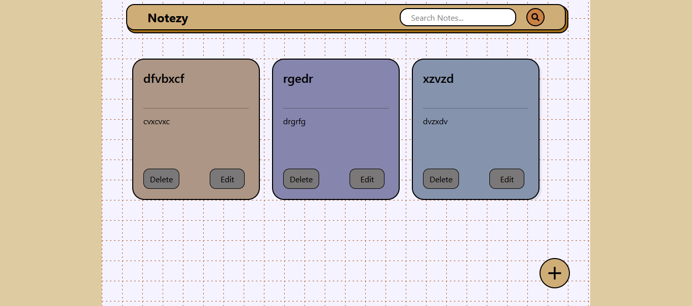
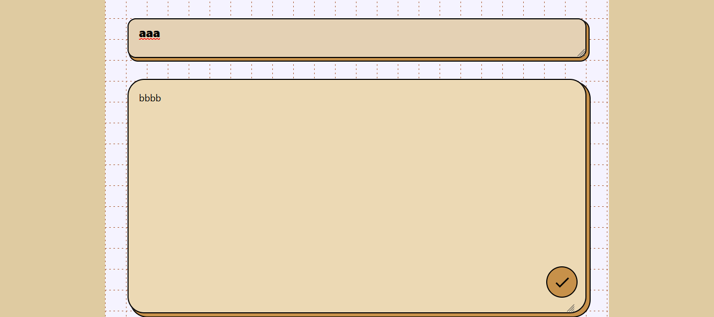
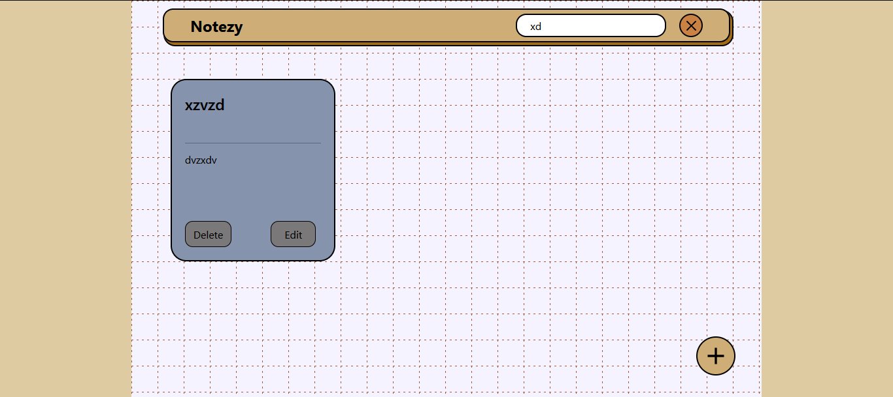

# ✅ Notezy – Notes App

A fully responsive and minimalistic **Notes App** built using **React JS and Tailwind CSS**.  
Notezy allows users to create, edit, delete, and search notes with a smooth and intuitive user experience. Each note is displayed with a randomly generated color, making the interface visually engaging.

## 📸 Screenshot  

<table align="center">
<tr>
  <th>Preview-1</th>
  <th>Preview-2</th>
</tr>
<tr>
  <td align="center">
    
  </td>
  <td align="center">
    
  </td>
</tr>
</table>

<br/>

<table align="center">
<tr>
  <th>Preview-3</th>
</tr>
<tr>
  <td align="center">
    
  </td>
</table>

---

## 🌐 Live Demo  

The project is live and can be viewed here :  [https/notezyy.netlify.app](https://notezyy.netlify.app/)

---

## ✨ Features

- 📝 Add new notes with title and content
- ✏️ Edit existing notes
- ❌ Delete notes
- 🔍 Search notes by title or content
- 🔄 Search icon toggles into a cross button to exit search mode
- ➕ Add button navigates to a dedicated note creation page
- 🎨 Each note has a random background color
- ⚠️ Prevents adding empty notes (shows alert)
- 💾 Notes persist using **LocalStorage**
- 📱 Fully responsive on mobile, tablet, and desktop
- ⚡ Smooth UI using Tailwind CSS
- 🧭 Simple and intuitive navigation

---

## 🛠️ Technologies Used

- React JS (with Hooks)
- Tailwind CSS
- JavaScript (ES6+)
- HTML5
- React Icons
- React Router DOM

---

## 📂 Project Structure

```bash
├── public/
├── src/
│   ├── components/
│   │   ├── Navbar.jsx
│   │   ├── Note.jsx
│   │   └── Notes.jsx
│   ├── pages/
│   │   ├── Note.jsx
│   │   └── Notes.jsx
│   ├── App.jsx
│   ├── main.jsx
│   └── index.css
├── package.json
└── README.md
```

---

## ⚙️ Getting Started

Follow these steps to run the project locally:

### Clone the repository
```bash
git clone https://github.com/your-username/Notezy.git

```

### Navigate to project directory 
```bash
cd Notezy
```
### Install dependencies 
```bash
npm install 
```

### Start development server
```bash
npm run dev
```
### app will run at:
```bash
http://localhost:5173
```
